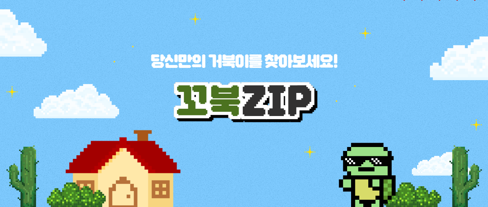
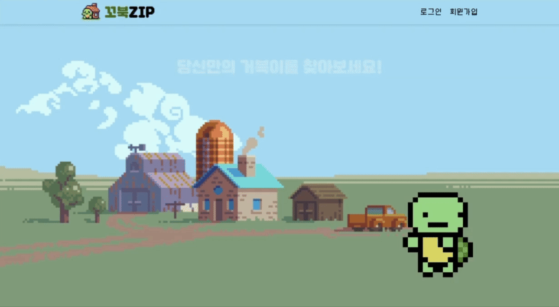
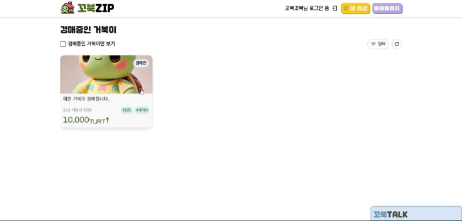
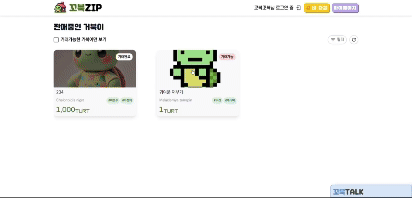
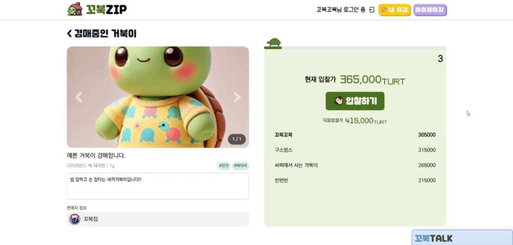
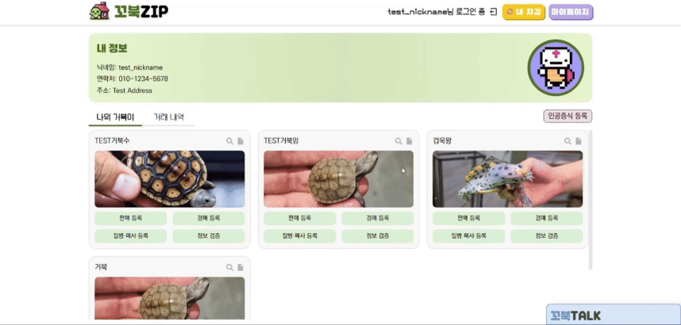
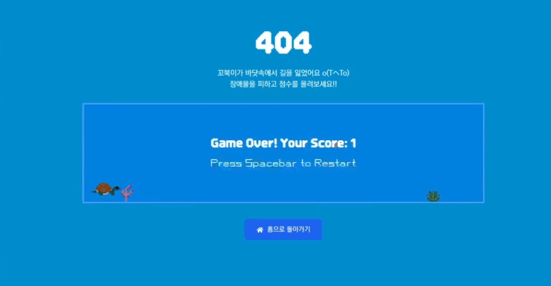

# 🐢 꼬북집 KKOBUKZIP

## 💚 프로젝트 소개

대부분의 거북이는 희귀동물로 분류되어, 양육 시 반드시 <b>CITES</b>라는 서류를 통해 환경부에 신고해야 합니다.

하지만 현재 이 과정이 너무 번거로워서 양도 및 양수 시 서류 진행이 원활하지 않아, 결국 양도받는 거북이가 불법 개체가 되는 경우가 자주 발생하고 있습니다.

합법적으로 희귀동물을 기르고 싶은 개인과 희귀동물 개체 관리를 원활하게 하고자 하는 정부를 위해 이 서비스를 기획하게 되었습니다.

> **"인공증식, 양도/양수, 폐사까지 거북이의 생애를 관리하고 안전한 거래를 돕는 플랫폼"**

- 인공증식, 양도/양수, 폐사 서류 등록 및 승인
- 서류 검토, 승인을 동반한 1:1 거래
- 현재 많이 이뤄지는 거래 방식인 경매 기능

[배포 링크 🔗](https://j11c107.p.ssafy.io/)

## 💚 프로젝트 기간

24.08.19 ~ 24.10.11 (8주)

(SSAFY 특화 프로젝트 - 블록체인 트랙)

## 💚 기술 스택

### **Backend**

             

### **Frontend**

        

### **BlockChain**

 

### **CI/CD**

     

### **Communication**

    

## 💚 프로젝트 산출물

- [기능명세서](./docs/기능명세서.md)
- [와이어프레임](./docs/와이어프레임.md)
- [API명세서](./docs/API명세서.md)
- [블록체인명세서](./docs/블록체인명세서.md)
- [ERD](./docs/ERD.md)
- [목업](./docs/목업.md)
- [아키텍처](./docs/아키텍처.md)

## 💚 프로젝트 결과물

- [포팅매뉴얼](./exec/)
- [중간발표자료](./docs/꼬북집_중간발표_PPT.pdf)
- [최종발표자료](./docs/꼬북집_최종발표_PPT.pdf)

## 💚 기능 및 화면 구성
### 메인

### 거래
- 구매

  

- 양수 서류 등록

  

### 경매
- 경매 진행

  

- 경매 낙찰

  

### 마이페이지
  

### 404 (거북이 달리기 게임)
  

## 💚 팀원 소개

|  |  |  |  |  |  | 
|---------------------------------------------------------------------------------------------------------------|----------------------------------------------------------------------------------------------------|---------------------------------------------------------------------------------------------------------------|-------------------------------------------------------------------------------------------------|--------------------------------------------------------------------------------------------------|--------------------------------------------------------------------------------------------------|
| 김여준([@junjunclub](https://github.com/junjunclub)) | 김영빈([@YBK1](https://github.com/YBK1)) | 신민경([@minggwen](https://github.com/minggwen)) | 김민선([@minseonkkim](https://github.com/minseonkkim)) | 서규범([@goosebbeoms](https://github.com/goosebbeoms)) | 한세훈([@DDARK00](https://github.com/DDARK00)) | 
| Leader / Back End | Back End / Blockchain | Back End | Front End | Front End / Blockchain | Front End |

